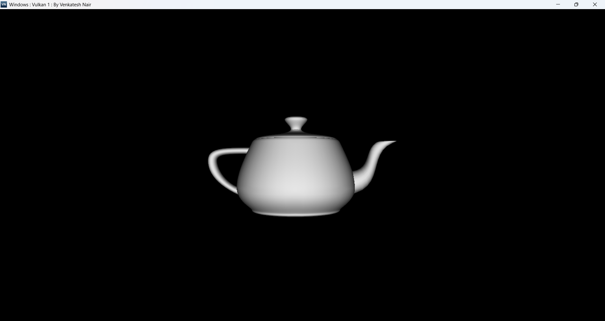
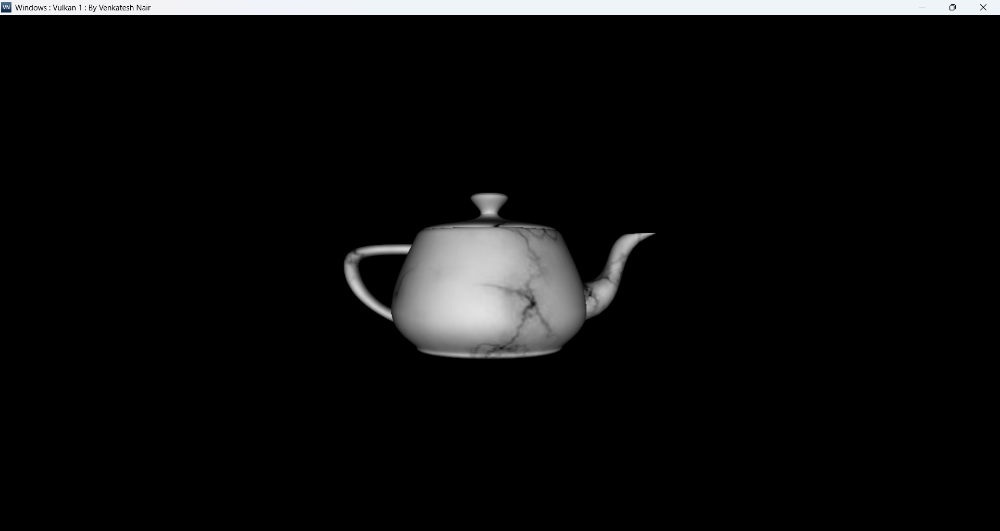

# Vulkan Teapot Renderer

A 3D graphics application demonstrating Vulkan rendering with Per-Pixel Phong lighting and texture mapping on the Utah Teapot.


## Features

- **Vulkan 1.3** graphics pipeline implementation
- **Per-pixel Phong lighting** with dynamic diffuse calculations
- **Texture mapping** with STB image loading
- **Indexed rendering** with optimized vertex buffers
- **Depth testing** for accurate 3D rendering
- **Dynamic uniform buffers** for transformations and lighting

## Tech Stack

- **Vulkan 1.3** - Graphics API
- **GLM** - Mathematics library
- **STB Image** - Texture loading
- **Win32 API** - Windowing

## Prerequisites

- Windows 10/11
- Visual Studio 2019+
- [Vulkan SDK 1.3+](https://vulkan.lunarg.com/)
- GLM library
- STB Image library

## Build & Run

1. **Install Vulkan SDK** from [LunarG](https://vulkan.lunarg.com/)
2. **Clone the repository**
3. **Compile shaders** (if not pre-compiled):
   ```bash
   glslc shaders/shader.vert -o shaders/shader.vert.spv
   glslc shaders/shader.frag -o shaders/shader.frag.spv
   ```
4. **Ensure required files** are in the executable directory:
   - `shaders/shader.vert.spv`
   - `shaders/shader.frag.spv`
   - `res/stone.png`
5. **Build and run** from Visual Studio

## Controls

| Key | Action |
|-----|--------|
| **L** | Toggle lighting |
| **T** | Toggle texture |
| **A** | Toggle animation |
| **F** | Toggle fullscreen |
| **ESC** | Exit |

## Rendering Pipeline

```
Instance → Physical Device → Logical Device → Swapchain
    ↓
Resources (Buffers, Textures, Depth)
    ↓
Shaders → Descriptors → Pipeline → Framebuffers
    ↓
Command Buffers → Render Loop (Acquire → Submit → Present)
```

## Project Structure

- `VK.cpp` - Main application and Vulkan setup
- `inc/VK.h` - Header file
- `inc/Teapot.h` - Geometry data
- `shaders/shader.vert` / `shaders/shader.frag` - GLSL shaders (source)
- `shaders/shader.vert.spv` / `shaders/shader.frag.spv` - Compiled SPIR-V shaders
- `res/stone.png` - Texture asset
- `inc/stb_image.h` - Image loading library

## Debug

Check `VMNlog.txt` for initialization logs and validation messages.

## Screenshots

   

## Author

**Venkatesh Nair**  
Email: nairvenky@gmail.com     
LinkedIn: https://www.linkedin.com/in/venkatesh-nair/


